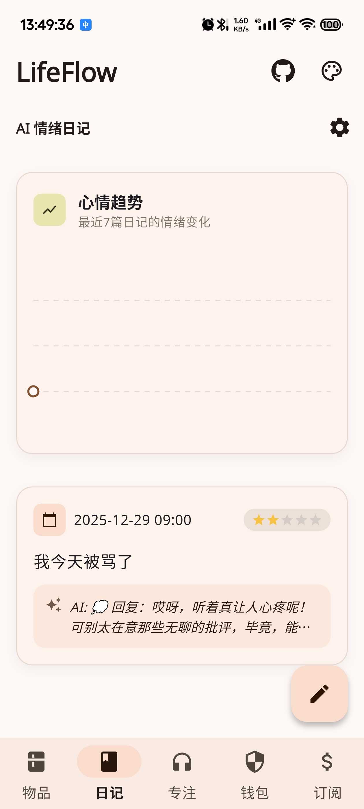
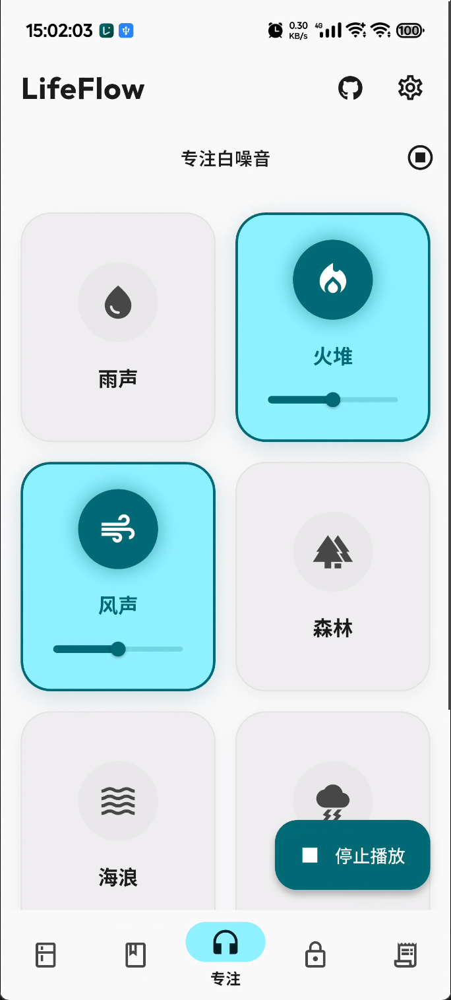
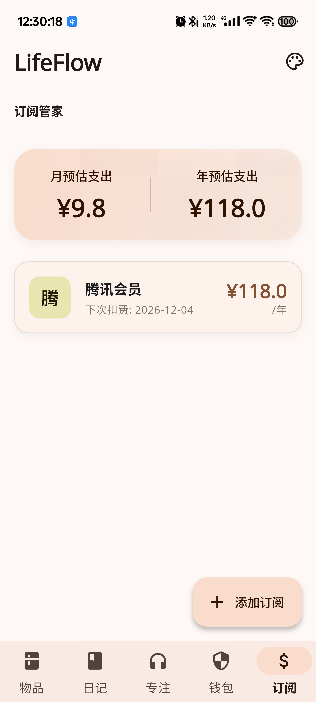

# LifeFlow (个人生活流)

LifeFlow 是一款集物品管理、情绪记录、专注辅助、隐私存储、订阅管理于一体的个人生活辅助工具。旨在通过极简的设计和隐私优先的原则，帮助用户更好地管理生活琐事。

## ✨ 核心功能 (Features)

LifeFlow 包含以下五个核心模块：

### 1. 🍎 物品与保质期管理 (Pantry & Expiry)
*   **物品录入**：记录物品名称、过期日期、分类。
*   **智能提醒**：通过颜色标记（红/黄/绿）直观展示过期状态，并在过期前 7天、3天、1天发送本地通知。
*   **条形码扫描**：支持扫描商品条形码自动填充信息。

### 2. 📝 AI 情绪日记 (AI Mood Journal)
*   **情绪记录**：记录每日心情指数（1-5星）和文字日记。
*   **AI 分析**：内置 AI 接口，分析日记内容并提供情感建议（需配置 API Key）。
*   **心情曲线**：可视化展示最近 7 天的心情波动趋势。

### 3. 🧘 专注白噪音 (Focus Mixer)
*   **白噪音播放**：提供雨声、雷声、风声等多种高质量白噪音。
*   **多轨混合**：支持同时播放多种声音并独立调节音量，打造个性化专注环境。
*   **后台播放**：支持锁屏后后台继续播放。

### 4. 🔐 隐私保险箱 (Secure Wallet)
*   **安全存储**：加密存储身份证、银行卡、密码等敏感信息。
*   **生物识别**：进入前强制进行指纹或面容验证。
*   **防截屏**：App 层面禁止截屏，保护隐私安全。

### 5. 💳 订阅管家 (Sub Manager)
*   **订阅管理**：记录各类订阅服务（Netflix, Spotify 等）的金额和周期。
*   **支出统计**：自动计算每月和每年的总支出。
*   **续费提醒**：在扣费日前发送通知提醒。

## 📱 应用截图 (Screenshots)

| 首页 (Home) | 物品管理 (Pantry) | 情绪日记 (Journal) |
|:---:|:---:|:---:|
|  |  |  |

| 专注模式 (Focus) | 隐私钱包 (Wallet) | 订阅管理 (Subs) |
|:---:|:---:|:---:|
|  |  |  |

## 🛠️ 技术栈 (Tech Stack)

*   **框架**: Flutter (Dart)
*   **架构**: MVVM + Provider
*   **本地存储**:
    *   Sqflite (结构化数据)
    *   Flutter Secure Storage (敏感数据加密)
    *   Shared Preferences (配置项)
*   **UI 风格**: Material Design 3
*   **核心库**:
    *   `provider`: 状态管理
    *   `flutter_local_notifications`: 本地通知
    *   `local_auth`: 生物识别
    *   `just_audio`: 音频播放
    *   `fl_chart`: 图表绘制
    *   `mobile_scanner`: 扫码功能
    *   `home_widget`: 桌面小组件

## � 下载安装 (Download)

请前往 **[Releases 页面](https://github.com/ningyou8023/lifeflow/releases)** 下载最新版本的 Android 安装包 (`.apk`)。

1.  下载最新的 `app-release.apk`。
2.  在 Android 手机上安装（可能需要允许“安装未知来源应用”的权限）。
3.  开始体验 LifeFlow！

## 📮 联系与反馈 (Contact & Feedback)

如果您有任何建议、Bug 反馈或合作意向，欢迎通过以下方式联系：

*   **GitHub Issues**: [提交 Issue](https://github.com/ningyou8023/lifeflow/issues)
*   **Email**: 505169296@qq.com
*   **QQ群**: 593347084

如果您喜欢这个项目，欢迎点一个 ⭐ Star 支持一下！

## 📄 许可证 (License)

本项目采用 MIT 许可证 - 详见 [LICENSE](LICENSE) 文件。
