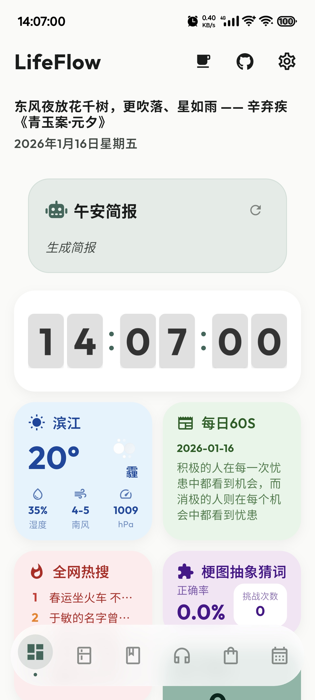
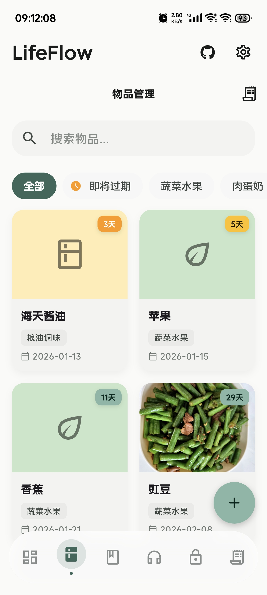
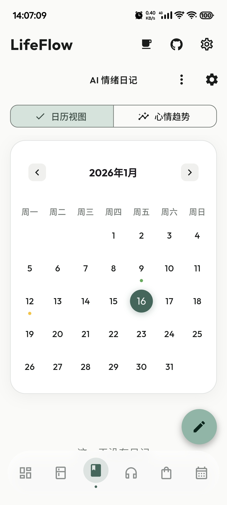
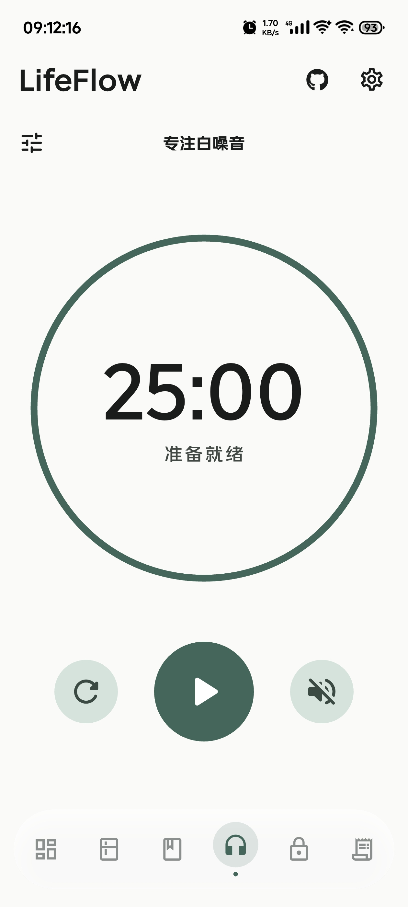
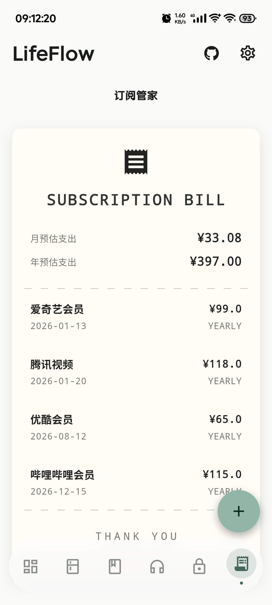
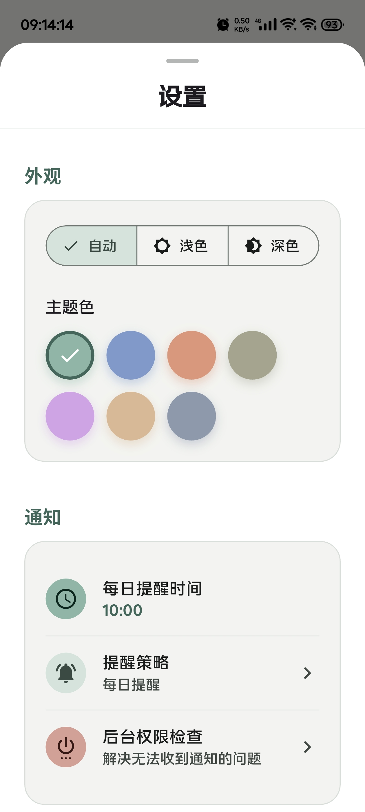
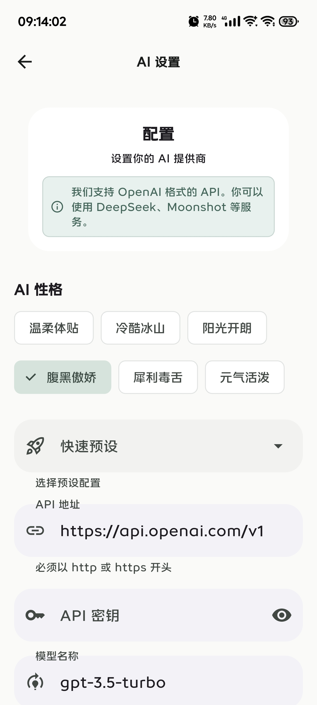
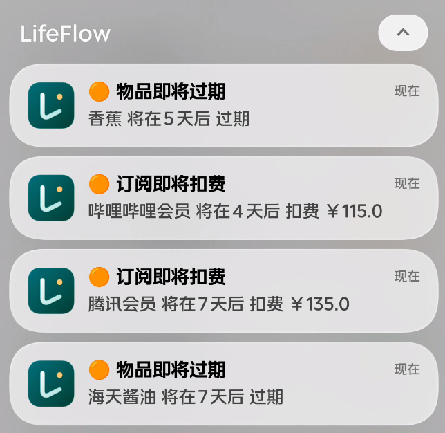
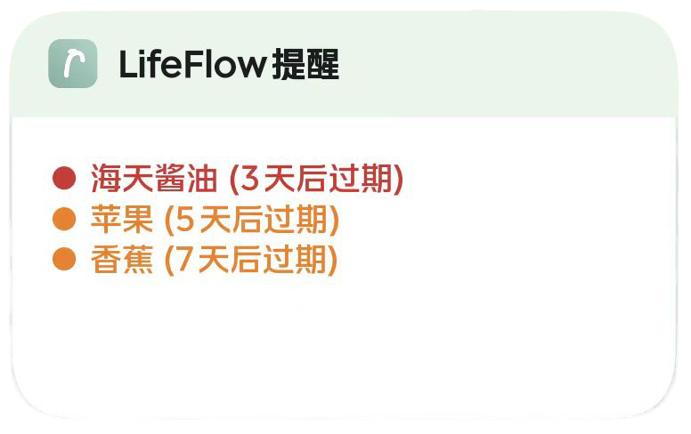

# LifeFlow (个人生活流)

LifeFlow 是一款集物品管理、情绪记录、专注辅助、隐私存储、订阅管理于一体的个人生活辅助工具。LifeFlow 迎来 v1.0.4 全新升级，UI/UX 全面焕新！采用现代化的 Material Design 3 设计语言，界面精致优雅，交互流畅自然。新增**首页概览**，优化核心模块布局，旨在通过极简的美学和隐私优先的原则，帮助用户更好地管理生活琐事。

## ✨ 核心功能 (Features)

LifeFlow 包含以下五个核心模块：

### 1. 🍎 物品与保质期管理 (Pantry & Expiry)
*   **物品录入**：记录物品名称、过期日期、分类。
*   **搜索与分类**：支持多维度分类筛选与关键词搜索，快速定位物品。
*   **智能提醒**：通过颜色标记（红/黄/绿）直观展示过期状态，并在过期前 7天、3天、1天发送本地通知。
*   **AI 智能识物**：支持扫描条形码，或通过**拍照/相册**识别物品名称，自动填充信息。
*   **智能菜谱**：AI 根据冰箱里的库存食材，为您推荐美味食谱，解决“吃什么”的难题。

### 2. 📝 AI 情绪日记 (AI Mood Journal)
*   **情绪记录**：记录每日心情指数（1-5星）和文字日记。
*   **日历视图**：以月度日历形式直观回顾心情轨迹与生活点滴。
*   **AI 分析**：内置 AI 接口，分析日记内容并提供情感建议。新增**深度分析**（情绪趋势与行为相关性）。
*   **数据导出**：支持将日记导出为 **Markdown** 格式，方便备份与分享。

### 3. 🧘 专注白噪音 (Focus Mixer)
*   **白噪音播放**：提供雨声、雷声、风声等多种高质量白噪音。
*   **多轨混合**：支持同时播放多种声音并独立调节音量，打造个性化专注环境。
*   **组合预设**：保存您喜欢的白噪音组合（如“雨天咖啡馆”），一键快速进入心流状态。
*   **番茄时钟**：内置番茄工作法，助您保持专注，劳逸结合。
*   **后台播放**：支持锁屏后后台继续播放。

### 4. 🔐 隐私保险箱 (Secure Wallet)
*   **安全存储**：加密存储身份证、银行卡、密码等敏感信息。
*   **隐私备份**：支持隐私数据的全量导出，确保隐私数据安全。
*   **生物识别**：进入前强制进行指纹或面容验证。
*   **防截屏**：App 层面禁止截屏，保护隐私安全。

### 5. 💳 订阅管家 (Sub Manager)
*   **订阅管理**：记录各类订阅服务（Netflix, Spotify 等）的金额和周期。
*   **汇率换算**：支持多币种自动汇率换算，统一统计总支出。
*   **支出统计**：自动计算每月和每年的总支出。
*   **续费提醒**：在扣费日前发送通知提醒。

### 6. 🛠️ 系统与体验 (System & Experience)
*   **国际化**：支持简体中文、繁体中文和英语，满足全球化使用需求。
*   **数据备份**：支持全局数据的加密导出与导入，轻松迁移数据。
*   **桌面小组件**：提供多种样式的小组件，并支持添加时预览。

## 📱 应用截图 (Screenshots)

| 首页 (Home) | 物品管理 (Pantry) |
|:---:|:---:|
|  |  |

| 情绪日记 (Journal) | 专注模式 (Focus) |
|:---:|:---:|
|  |  |

| 订阅管理 (Subs) | 外观设置 (Appearance) |
|:---:|:---:|
|  |  |

| AI 设置 (AI Config) | 通知中心 (Notifications) |
|:---:|:---:|
|  |  |

| 桌面小组件 (Widgets) | |
|:---:|:---:|
|  | |

> **注**：隐私钱包 (Wallet) 页面因系统安全机制（禁止截屏），故无法展示截图。

## ⚠️ 权限与通知说明 (Permissions & Notifications)

为了确保 **智能提醒** 和 **每日推送** 能够准时送达（尤其是早晨的过期提醒），请务必在 Android 手机上授予以下权限：

1.  **自启动权限 (Auto-Start)**: 允许 App 在后台自动启动，防止被系统查杀。
2.  **电池优化白名单 (Ignore Battery Optimization)**: 设置为"无限制"或"允许后台高耗电"，防止系统为了省电而延迟或取消定时闹钟。
3.  **通知权限 (Post Notifications)**: 允许 App 发送通知栏消息。
4.  **精确闹钟权限 (Schedule Exact Alarm)**: 确保在设定的具体时间（如 9:00）准时提醒，而不是被系统延迟到"维护窗口"期。

> 💡 **提示**: 如果您发现通知不准时或不弹窗，请检查手机管家/设置中的上述权限是否已开启。

## 🛠️ 技术栈 (Tech Stack)

*   **框架**: Flutter (Dart)
*   **架构**: MVVM + Provider
*   **本地存储**:
    *   Sqflite (结构化数据)
    *   Flutter Secure Storage (敏感数据加密)
    *   Shared Preferences (配置项)
*   **UI 风格**: 全新 Material Design 3 (现代化设计与精致动效)
*   **核心库**:
    *   `provider`: 状态管理
    *   `flutter_local_notifications`: 本地通知
    *   `local_auth`: 生物识别
    *   `just_audio`: 音频播放
    *   `fl_chart`: 图表绘制
    *   `mobile_scanner`: 扫码功能
    *   `home_widget`: 桌面小组件

## 📥 下载安装 (Download)

请前往 **[Releases 页面](https://github.com/ningyou8023/lifeflow/releases)** 下载最新版本的 Android 安装包 (`.apk`)。

1.  下载最新的 `app-release.apk`。
2.  在 Android 手机上安装（可能需要允许“安装未知来源应用”的权限）。
3.  开始体验 LifeFlow！

## 📮 联系与反馈 (Contact & Feedback)

如果您有任何建议、Bug 反馈或合作意向，欢迎通过以下方式联系：

*   **GitHub Issues**: [提交 Issue](https://github.com/ningyou8023/lifeflow/issues)
*   **Email**: 505169296@qq.com
*   **QQ群**: 593347084

如果您喜欢这个项目，欢迎点一个 ⭐ Star 支持一下！

## 📄 许可证 (License)

本项目采用 MIT 许可证 - 详见 [LICENSE](LICENSE) 文件。
